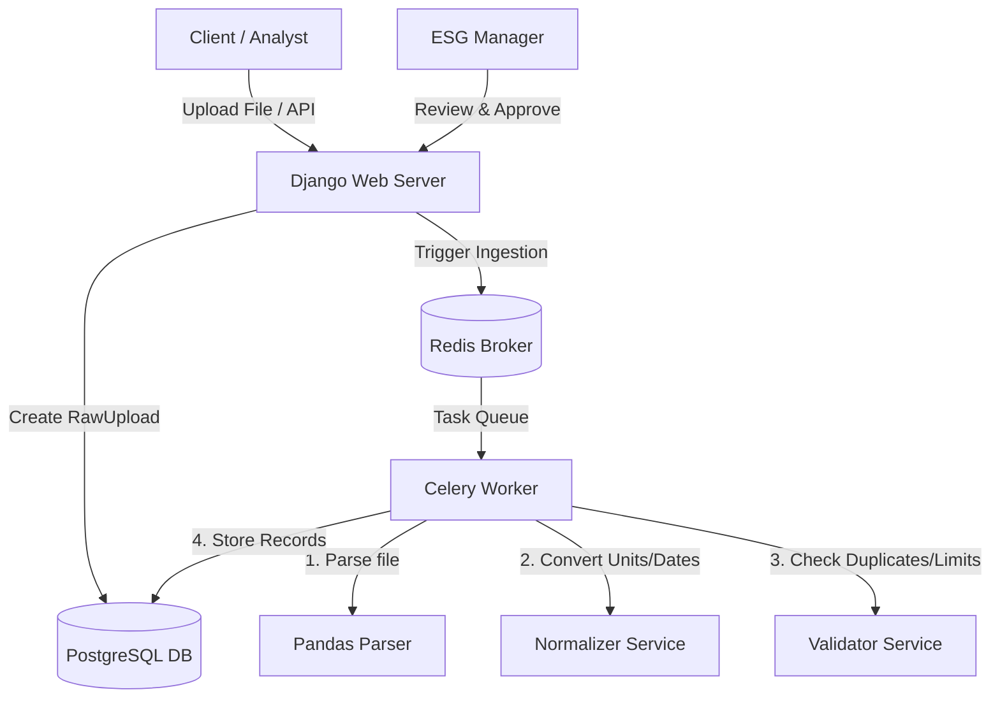

# ESG Data Ingestion and Review Platform

This is a production-grade, enterprise-ready Django-based backend for an Environmental, Social, and Governance (ESG) data ingestion, normalization, and review platform. The backend is designed as a **Modular Monolith** and is built on top of a highly scalable, audit-safe architecture.

## Tech Stack
- **Python**: 3.12 (standard typing and strict coding standards)
- **Django & Django REST Framework**: Core web framework and API serialization layer
- **PostgreSQL**: Relational database for transaction auditing and ESG state tracking
- **Redis**: Token validation session cache and Celery broker
- **Celery**: Background parsing, normalization, and validation execution
- **Docker & Docker-Compose**: Service orchestration and container management
- **Pandas**: Efficient tabular parsing of messy CSV files
- **Pydantic**: Contract structures and AI schema preparation validation

---

## System Architecture

The platform uses **Clean Architecture** patterns separated into isolated applications (`apps/`):
1. **`common`**: Global exception handlers, JSON logging middleware, correlation ID tracking, readiness checks, and unit conversion utilities.
2. **`users`**: Enterprise JWT authentication utilizing simplejwt with active session whitelists in Redis and Argon2 password hashing.
3. **`ingestion`**: Source-specific parsing, normalization, and validation rules (for SAP fuel records, Utility electricity records, and Travel booking data).
4. **`ai_cleaning`**: Interface contracts, prompt schemas, and abstract classes ready for future LLM mapping integrations.



---

## Database Design (PostgreSQL Models)

1. **`User`**: UUID keys, custom roles (`analyst`, `manager`, `admin`), email login, timestamps, and soft deletion.
2. **`RawUpload`**: Tracks file location, format type (SAP, Utility, Travel), processing status (`PENDING`, `PROCESSING`, `COMPLETED`, `FAILED`), row count, and processing errors.
3. **`RawRecord`**: Retains the verbatim parsed JSON row payload to guarantee data auditability.
4. **`NormalizedRecord`**: Contains standard keys: `record_date`, `standard_category` (fuel, electricity, travel), `quantity` (Decimal), `unit` (L, kWh, km), and standard JSON attributes.
5. **`ValidationIssue`**: Connects to raw/normalized records. Supports severity levels (`warning`, `error`), rule codes (e.g. `MISSING_QUANTITY`, `SUSPICIOUS_USAGE`, `DUPLICATE_INVOICE`), resolution statuses, and auditing fields.
6. **`ApprovalRecord`**: Captures manager approval decisions (`approved`, `rejected`) and explanation comments.
7. **`AuditLog`**: Standardized immutable records capturing system actions, modified tables, target IDs, IP addresses, and user agents.

---

## API Endpoints

### Authentication (`/api/v1/auth/`)
- `POST /register/`: Register a new user with `analyst` or `manager` roles.
- `POST /login/`: Login and fetch access/refresh tokens.
- `POST /refresh/`: Rotate expired access token (verifies Redis whitelist).
- `POST /logout/`: Revoke current session refresh token.
- `GET /me/`: Retrieve current user profile details.

### Uploads & Ingestion (`/api/v1/uploads/`)
- `POST /`: Upload a file (`.csv` or `.json`), declare the `source_type` (sap, utility, travel), and trigger the background Celery parser. Enforces 20MB file size limits and file extensions.
- `GET /`: List all uploads.
- `GET /<uuid>/`: Retrieve upload metadata and row status.
- `GET /records/`: List normalized ESG records (Filterable by `raw_upload`, `standard_category`, `status`).
- `GET /records/<uuid>/issues/`: Retrieve validation warning/error issues.
- `POST /records/<uuid>/resolve-issues/`: Mark all validation issues for a record as resolved.
- `POST /records/<uuid>/approve/`: Approve or reject a record (Managers/Admins only).

### System Health (`/api/v1/system/`)
- `GET /health/`: Ping endpoint (Returns 200).
- `GET /readiness/`: Deep readiness check validating Postgres and Redis connectivity.

---

## Running Locally (Docker Compose)

### 1. Configure the environment
Copy the template configuration:
```bash
cp .env.example .env
```

### 2. Boot the services
```bash
docker-compose up --build
```
This command starts:
- **`db`**: PostgreSQL 16 database container.
- **`redis`**: Redis 7 cache/broker container.
- **`web`**: Django server running locally on `http://localhost:8000`.
- **`celery_worker`**: Celery worker running file parsing task loops.
- **`celery_beat`**: Celery scheduler for cron loops.

### 3. Generate a Superuser
```bash
docker-compose exec web python manage.py createsuperuser
```

---

## Validation Engine & Pipeline Rules

### SAP Ingestion (Fuel CSV)
- **Normalizations**: Maps German headers (*Menge*, *Einheit*, *Buchungsdatum*). Converts Gallons to Liters (`L`). Parses dates (*DD.MM.YYYY*).
- **Validations**: Missing quantity, invalid unit, high fuel volume (>50,000 L, warning), duplicate invoice number (error).

### Utility Ingestion (Electricity CSV)
- **Normalizations**: Converts Megawatt-hours (MWh) to kilowatt-hours (`kWh`). Parses read dates.
- **Validations**: Missing quantity, invalid unit, high electricity consumption (>100,000 kWh, warning), duplicate invoice number (error).

### Corporate Travel Ingestion (Travel JSON API)
- **Normalizations**: Converts distance miles to kilometers (`km`). Parses booking dates.
- **Validations**: Missing distance, invalid unit, future booking date (warning), duplicate ticket number (error).

---

## Database & Cache Web GUIs

Once the services are booted, you can access the visualizer interfaces:
- **pgweb (PostgreSQL GUI)**: Open [http://localhost:8081](http://localhost:8081) in your browser. It connects automatically to the `esg_db` database.
- **redis-commander (Redis GUI)**: Open [http://localhost:8082](http://localhost:8082) in your browser to view keys stored in the Redis server.

