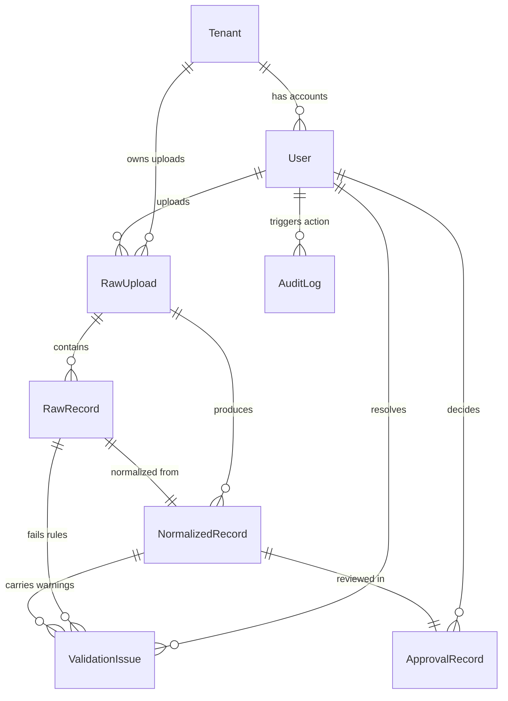

# ESG Ingestion Platform Data Model Reference

This document describes the database design of the ESG Ingestion and Review Platform, outlining its layout, relationships, and structural choices for multi-tenancy, emission categorization, data lineage, unit standardization, and auditability.

---

## 1. Schema Layout & Entity Relationships

The system uses a highly structured relational database schema built on PostgreSQL, utilizing UUIDs as primary keys to facilitate distributed key generation.



### Table Mapping Spec

#### 1. `tenants` (Multi-Tenancy Root)
Isolates organizational spaces. Every tenant represents a distinct corporate entity or independent client.
* `id` (UUID, Primary Key)
* `name` (VARCHAR)
* `domain` (VARCHAR, Unique)
* `created_at` (DateTimeField)

#### 2. `users` (Custom User Model)
Implements role-based credentials.
* `id` (UUID, Primary Key)
* `tenant_id` (UUID, Foreign Key referencing `tenants`)
* `email` (VARCHAR, Unique)
* `password_hash` (VARCHAR)
* `role` (ChoiceField: `analyst` | `manager` | `admin`)
* `is_verified` (Boolean)
* `created_at` (DateTimeField)

#### 3. `raw_uploads` (File-Level Ingestion Entry)
* `id` (UUID, Primary Key)
* `tenant_id` (UUID, Foreign Key referencing `tenants`)
* `user_id` (UUID, Foreign Key referencing `users`)
* `status` (ChoiceField: `PENDING` | `PROCESSING` | `COMPLETED` | `FAILED`)
* `source_type` (ChoiceField: `sap` | `utility` | `travel`)
* `original_filename` (VARCHAR)
* `file_path` (VARCHAR)
* `row_count` (Integer)
* `error_message` (TextField)
* `created_at` (DateTimeField)

#### 4. `raw_records` (Raw Data Preserves)
Stores individual records exactly as parsed from the original file, guaranteeing that data lineage checks can inspect raw sources at any time.
* `id` (UUID, Primary Key)
* `raw_upload_id` (UUID, Foreign Key referencing `raw_uploads`)
* `row_number` (Integer)
* `data` (JSONB)
* `created_at` (DateTimeField)
* **Constraints**: `unique_together = ('raw_upload', 'row_number')`

#### 5. `normalized_records` (Emissions Target Data)
Holds standardized emissions records ready for auditing and dashboard rendering.
* `id` (UUID, Primary Key)
* `raw_upload_id` (UUID, Foreign Key referencing `raw_uploads`)
* `raw_record_id` (UUID, Foreign Key referencing `raw_records`)
* `record_date` (DateField)
* `standard_category` (ChoiceField: `fuel` | `electricity` | `travel`)
* `quantity` (NUMERIC(20, 4))
* `unit` (VARCHAR)
* `data` (JSONB)
* `status` (ChoiceField: `PENDING` | `APPROVED` | `REJECTED`)
* `created_at` (DateTimeField)

#### 6. `validation_issues` (Data Quality Errors)
* `id` (UUID, Primary Key)
* `normalized_record_id` (UUID, Foreign Key referencing `normalized_records`, Nullable)
* `raw_record_id` (UUID, Foreign Key referencing `raw_records`)
* `field_name` (VARCHAR)
* `severity` (ChoiceField: `warning` | `error`)
* `rule_code` (VARCHAR)
* `message` (TextField)
* `metadata` (JSONB)
* `resolved` (Boolean)
* `resolved_by_id` (UUID, Foreign Key referencing `users`, Nullable)

#### 7. `approval_records` (Governance Sign-Off Ledger)
* `id` (UUID, Primary Key)
* `normalized_record_id` (UUID, Foreign Key referencing `normalized_records`)
* `approved_by_id` (UUID, Foreign Key referencing `users`)
* `action` (ChoiceField: `approved` | `rejected`)
* `comments` (TextField)
* `created_at` (DateTimeField)

#### 8. `audit_logs` (Immutable Logging Ledger)
Independent entity storing historical edits.
* `id` (UUID, Primary Key)
* `user_id` (UUID, Foreign Key referencing `users`, Nullable)
* `action` (VARCHAR)
* `table_name` (VARCHAR)
* `record_id` (UUID)
* `changes` (JSONB)
* `ip_address` (GenericIPAddressField)
* `user_agent` (VARCHAR)
* `created_at` (DateTimeField)

---

## 2. Core Functional Requirements Design

### Multi-Tenancy Architecture
The system supports **Row-Level Shared-Database Multi-Tenancy**:
1. Every client or organization receives a unique record in the `tenants` table.
2. Tables containing business data (`users`, `raw_uploads`, and downstream `normalized_records` via uploads) carry a `tenant_id` foreign key constraint.
3. In Django, a custom tenant context middleware extracts the tenant based on request parameters (e.g. host domain `client1.esg-portal.com` or request headers). It sets a thread-local tenant context.
4. Custom Django QuerySets enforce tenant isolation automatically:
   ```python
   class TenantManager(models.Manager):
       def get_queryset(self):
           return super().get_queryset().filter(tenant_id=get_current_tenant_id())
   ```
   This prevents database leakage across entities while minimizing hosting costs.

### Scope 1, 2, and 3 Categorization
To compile greenhouse gas compliance audits, normalized records are classified according to the GHG Protocol:

| Standard Category | Source Type | GHG Emissions Scope | Emission Details |
| :--- | :--- | :--- | :--- |
| **`fuel`** | `sap` | **Scope 1 (Direct)** | Physical combustion of fuel on-site (e.g., diesel or natural gas in company generators or vehicles). |
| **`electricity`** | `utility` | **Scope 2 (Indirect)** | Purchased electricity consumed by company facilities (Scope 2 indirect energy source). |
| **`travel`** | `travel` | **Scope 3 (Other Indirect)** | Corporate employee business travel (Category 6: Business Travel; third-party transport bookings). |

### Source-of-Truth Tracking & Lineage
To ensure that an auditor can trace any single emission metric back to its origin:
1. Every row in `normalized_records` carries a foreign key link back to its corresponding `raw_record_id` (which contains the exact original column key-value layout) and the `raw_upload_id` (containing upload metadata like username, original filename, and upload datetime).
2. If an analyst resolves a validation issue or overrides a record's warnings, the system preserves the raw record's original data while logging the mutation change directly to the `audit_logs` table (detailing old vs. new values).
3. The raw record itself is completely **immutable**; no update queries are allowed on the `raw_records` table, preserving the original uploaded file payload.

### Unit Normalization & Precision Arithmetic
Environmental datasets contain widely varying metrics (e.g. US Gallons, Liters, MWh, kWh, Miles, Kilometers).
1. The ingestion pipeline runs normalizer engines (`apps/ingestion/services/normalizers.py`) that map input columns to unified base units:
   * **Fuel**: Standardized to Liters (`L`).
   * **Electricity**: Standardized to Kilowatt-hours (`kWh`).
   * **Travel**: Standardized to Kilometers (`km`).
2. Calculations are executed using **Decimal arithmetic** (`models.DecimalField(max_digits=20, decimal_places=4)`) rather than floats. This ensures absolute precision, avoiding the rounding errors inherent in IEEE 754 float types that could invalidate regulatory compliance reporting.
3. The original units and quantities are preserved as attributes within the `data` JSONB column of the normalized record for comparative verification.

### Audit Trail Governance
Changes are tracked in the database through two distinct layers:
1. **Validation & Resolution Tracking**:
   * The `validation_issues` table stores unresolved/resolved states, mapping which user resolved the error and their text override comments.
2. **System-wide Audit Trail**:
   * Every critical action (login attempts, upload files, validation overrides, approval decisions) triggers an event saved to `audit_logs`.
   * The table does not inherit soft-delete capabilities and has no update routes, making it a read-only, tamper-resistant ledger for auditors.
