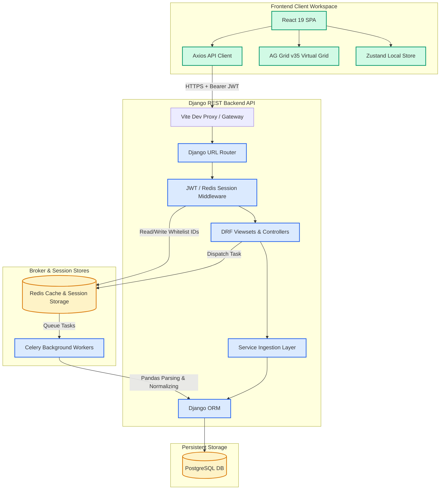
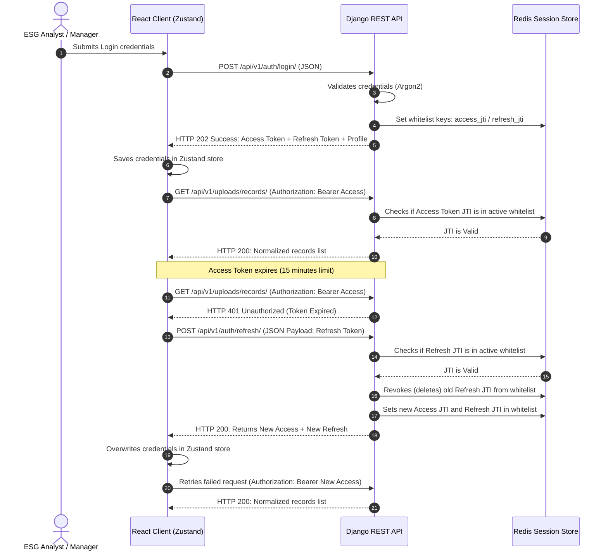
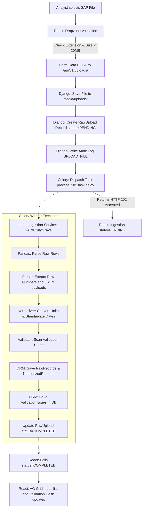

# Platform System Architecture & Workflows

This document explains the technical architecture, request-response pipelines, and asynchronous execution lifecycles of the ESG Data Ingestion and Review Platform.

---

## 1. System Components Diagram

The platform is designed as a **Modular Monolith** backend supporting a React Single-Page Application (SPA) frontend. 

---

## 2. Authentication & Token Rotation Sequence

The platform uses JWT Access/Refresh token authentication with a Redis-backed session whitelist. If a refresh token is reused, or an active logout is executed, the session is invalidated instantly.

---

## 3. End-to-End Ingestion Request Flow

When an Analyst ingests a CSV or JSON file, parsing and unit normalizing is executed asynchronously in the background.

---

## 4. Record Approval Lifecycle

Normalized records must undergo manager reviews before inclusion in GHG emission reports.

```mermaid
sequenceDiagram
    autonumber
    actor Manager as ESG Manager
    participant App as React Client
    participant API as Django REST API
    participant DB as PostgreSQL DB
    participant Ledger as AuditLog Table

    Manager->>App: Opens /approvals workspace
    App->>API: GET /api/v1/uploads/records/ (Query: status=PENDING)
    API-->>App: Returns array of pending records with quality warnings
    App->>App: Disables Approve button if critical issues exist
    Manager->>App: Fills comments and clicks "Approve Record"
    App->>API: POST /api/v1/uploads/records/{id}/approve/ (action=approved)
    
    API->>API: Validates IsESGManager role
    API->>API: Verifies record has no unresolved validation errors
    
    rect rgb(30, 41, 59)
        Note over API, DB: Transaction boundary
        API->>DB: Updates normalized_records.status = 'APPROVED'
        API->>DB: Inserts row into approval_records table
        API->>Ledger: Inserts row into audit_logs table
    end
    
    API-->>App: HTTP 200: Success status change message
    App->>App: Updates grid locally and triggers fetchRecords()
    App-->>Manager: Displays success toast banner
```

