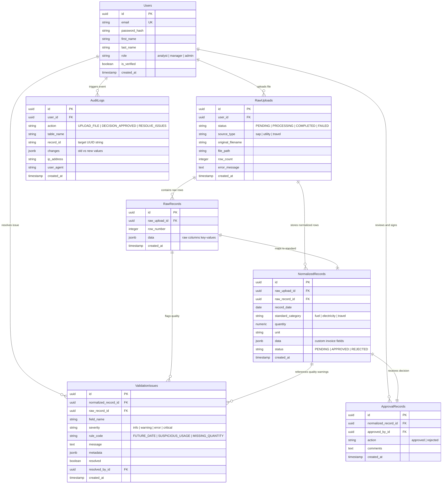

# Database Architecture & Schema Design

This document details the PostgreSQL database schemas, entity relationships, unique constraints, and optimization indexes of the ESG platform.

---

## 1. Entity-Relationship (ER) Diagram

The relationships between users, raw files uploads, normalized rows, validation issues, approvals, and audits are structured as follows:



---

## 2. Table Specifications

### `raw_records`
* **Purpose**: Immutable copy of the raw rows parsed from CSV or JSON files.
* **Why it exists**: Guarantees auditability. We can always re-trace exactly what was uploaded before normalization rules ran.
* **Key Constraints**:
  * Unique Constraint: `unique_together = ('raw_upload', 'row_number')` to prevent duplicate row parsing.

### `normalized_records`
* **Purpose**: Holds normalized values after unit conversion and column mapping.
* **Attributes**:
  * `quantity` is a high-precision `NUMERIC(20, 4)` to prevent IEEE 754 floating-point rounding errors during GHG emissions calculation.

### `validation_issues`
* **Purpose**: Registers compliance rule matches.
* **Attributes**:
  * `metadata` is a `JSONB` column containing the values that triggered the issue (e.g. `{"quantity": 55000.0, "limit": 50000}`) for inline review dashboard rendering.

### `audit_logs`
* **Purpose**: Secure logs ledger.
* **Attributes**:
  * `changes` is a `JSONB` diff storing state changes (e.g., `{"old_status": "PENDING", "new_status": "APPROVED", "comments": "..."}`).

---

## 3. Indexing & Optimization Strategy

To maintain rapid rendering times on AG Grid dashboards containing millions of rows, the database implements explicit indexing fields:

1. **Foreign Key Indexes**:
   All foreign keys (`raw_upload_id`, `raw_record_id`, `normalized_record_id`) are indexed to speed up query joins.

2. **Search Filters Indexes**:
   ```sql
   -- Speeds up Review workspace filters
   CREATE INDEX idx_norm_category_status ON normalized_records (standard_category, status);
   
   -- Speeds up timeline calculations on the main dashboard
   CREATE INDEX idx_norm_record_date ON normalized_records (record_date);
   ```

3. **Audit Ledger Indexes**:
   To trace changes on specific rows quickly:
   ```sql
   -- Allows fast lookups of audit trails for any specific record
   CREATE INDEX idx_audit_table_record ON audit_logs (table_name, record_id);
   ```
