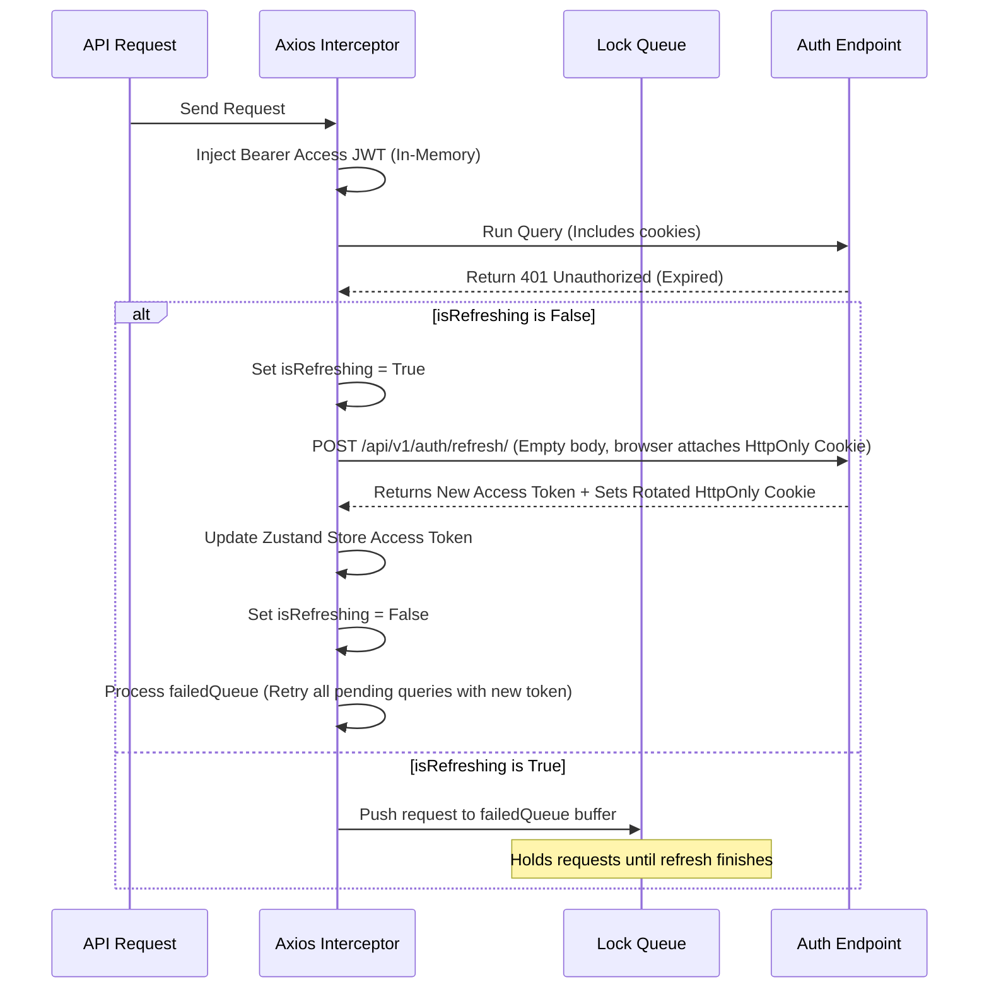

# Frontend Systems Reference Guide

This document describes the design, state management, style systems, and data grid configurations of the React single-page client.

---

## 1. Single Page Application Architecture

The frontend is structured to keep UI layouts separate from business logic state management. 

```
frontend/
├── src/
│   ├── components/      # UI Shell layouts and reusable badges
│   ├── store/           # Zustand global state stores
│   ├── pages/           # Platform page views
│   ├── lib/             # Axios client configurations
│   ├── types/           # Shared TypeScript interfaces
│   ├── utils/           # Static mock fallback datasets
│   ├── App.tsx          # Router mapping configurations
│   └── main.tsx         # Global imports and module registrations
├── tailwind.config.js   # Style layouts override metrics
└── vite.config.ts       # Proxy mappings and compilation rules
```

---

## 2. State Management Boundary

The client maintains a clean division between session states and server data models.

```
                  ┌──────────────────────────────────────────┐
                  │            Client State (Zustand)        │
                  │  - Auth Tokens                           │
                  │  - Theme Mode (Light/Dark)               │
                  │  - Global Toast Queue                    │
                  └────────────────────┬─────────────────────┘
                                       │
                                       ▼
                  ┌──────────────────────────────────────────┐
                  │            API Client (Axios)            │
                  │  - Request/Response Interceptors         │
                  │  - Bearer Access Injection               │
                  │  - HttpOnly Cookie Support               │
                  └──────────────────────────────────────────┘
```

### Global Session Stores (Zustand)
1. **`authStore`** (in `store/authStore.ts`): Holds details of the currently authenticated user profile and `accessToken` strictly in-memory (no credentials are saved to `localStorage` or `sessionStorage` to mitigate XSS attacks). It provides a `checkAuth()` method that performs silent token rotation on app mount or refresh to restore user session from the HttpOnly refresh token cookie.
2. **`uiStore`** (in `store/uiStore.ts`): Manages the state of the sidebar drawer, theme mode class (`light` vs. `dark`) (saved in `localStorage` for visual persistence), and the global toast alerts queue.

---

## 3. Custom API Interceptors & JWT Rotations

Location: [axios.ts](file:///c:/Users/shiva/OneDrive/Desktop/SAP/frontend/src/lib/axios.ts)

A central Axios instance (`apiClient`) configured with `withCredentials: true` intercepts outgoing requests to inject the active Bearer `accessToken` from Zustand. It also intercepts incoming responses to handle token expiration by executing cookie-based silent refresh:



---

## 4. AG Grid Virtualization Configurations

High-density environmental records require optimized table rendering performance. The Review Workspace embeds **AG Grid v35** with the following production configurations:

* **Grid Virtualization**: AG Grid dynamically renders only the rows visible in the viewport DOM, minimizing memory footprints.
* **Global Module Registry**:
  We register the community modules once at startup in `main.tsx` using `ModuleRegistry.registerModules([AllCommunityModule])` to avoid passing modules attributes to individual tables.
* **Component Cell Renderers**:
  Custom status chips (e.g. `PENDING`, `APPROVED`, `REJECTED`) are formatted dynamically using the `StatusBadge` renderer.

```typescript
// Column configuration mapping inside IngestionReview.tsx
const columnDefs = [
  { field: 'standard_category', headerName: 'Category', width: 130 },
  { field: 'quantity', headerName: 'Quantity', cellRenderer: (p) => p.value.toFixed(2) },
  { field: 'status', headerName: 'Status', cellRenderer: (p) => <StatusBadge status={p.value} /> }
];
```

---

## 5. Tailwind CSS v4 Theme Mapping

We utilize HSL css variables in `index.css` to manage dark and light themes. Class modifications are applied by appending `.dark` to the `document.documentElement` HTML element:

```css
/* index.css theme mapping values */
:root {
  --background: 224 71.4% 4.1%; /* Dark background by default */
  --foreground: 210 20% 98%;
  --primary: 142.1 70.6% 45.3%; /* Premium Emerald Green */
  ...
}

.light {
  --background: 0 0% 100%; /* Crisp light background */
  --foreground: 224 71.4% 4.1%;
  ...
}
```
Adding class-based theme overrides allows Tailwind to compile utility styles dynamically (e.g. `bg-background` and `text-foreground`).
