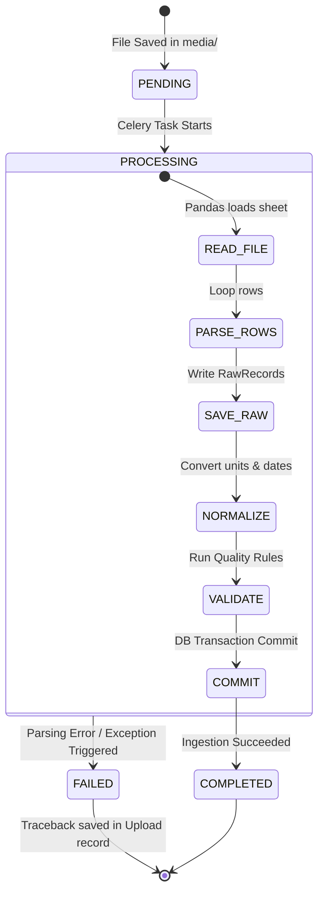

# Data Ingestion Pipelines

This document details the file parsers, asynchronous scheduling, and task retry policies of the ingestion engine.

---

## 1. Source-Specific Ingestion Architecture

Enterprises utilize separate systems that generate disparate data schemas. To handle this, the platform delegates parsing to **source-specific modules**:

```
Raw File Upload ──> Ingest Viewset (POST) ──> File System Store (media/)
                                                     │
                                                     ▼
                                          [process_file_task]
                                                     │
                             ┌───────────────────────┼───────────────────────┐
                             ▼                       ▼                       ▼
                        [SAP Parser]         [Utility Parser]         [Travel Parser]
                        - Reads CSV          - Reads CSV              - Reads JSON
                        - German Headers     - Multi-word Headers     - Airport Keys
```

### Why Source-Specific Pipelines?
Instead of a single complex parser with conditional clauses, source-specific pipelines maintain **Separation of Concerns**. Adding a new vendor or data structure only requires writing a new isolated parser class without risking regressions in existing streams.

---

## 2. Ingestion Services Mapping

### 1. SAP Fuel Parser
* **Location**: [parser.py](file:///c:/Users/shiva/OneDrive/Desktop/SAP/apps/ingestion/services/sap/parser.py)
* **Format**: Comma-Separated Values (CSV).
* **Expected Raw Column Headers**:
  * `menge`: Quantity value.
  * `einheit`: Unit indicator (e.g. `gallons`, `liters`).
  * `buchungsdatum`: Posting date.
  * `kraftstofftyp`: Fuel type (e.g. `diesel`, `petrol`).
  * `belegnummer`: Document / invoice identifier.
* **Technology**: Uses **Pandas** to load the CSV, sanitizing whitespace and parsing rows into dictionary inputs.

### 2. Utility Electricity Parser
* **Location**: [parser.py](file:///c:/Users/shiva/OneDrive/Desktop/SAP/apps/ingestion/services/utility/parser.py)
* **Format**: Comma-Separated Values (CSV).
* **Expected Raw Column Headers**:
  * `account number`: Energy billing account ID.
  * `read date`: Historical meter reading date.
  * `usage (mwh)`: Electricity quantity value in Megawatt-hours.
  * `invoice number`: Bill identifier.
* **Technology**: Uses **Pandas** with header normalization, automatically mapping space characters to underscores.

### 3. Corporate Travel Parser
* **Location**: [parser.py](file:///c:/Users/shiva/OneDrive/Desktop/SAP/apps/ingestion/services/travel/parser.py)
* **Format**: JSON array of objects.
* **Expected JSON Object Keys**:
  * `employee_id`: Identifier for the employee traveling.
  * `departure_airport` & `arrival_airport`: Airport codes (e.g., LHR, JFK).
  * `distance_miles`: Distance traveled.
  * `booking_date`: Booking transaction date.
  * `ticket_number`: Ticket invoice ID.
* **Technology**: Python's native `json` library, parsing records into row mappings.

---

## 3. Asynchronous Task Lifecycle

Background worker execution is orchestrated via **Celery** as follows:



### Celery Task Implementation
Location: [tasks.py](file:///c:/Users/shiva/OneDrive/Desktop/SAP/apps/ingestion/tasks.py)

```python
@shared_task(bind=True)
def process_file_task(self, upload_id):
    from apps.ingestion.models import RawUpload
    from apps.ingestion.services.file_processor import FileProcessor
    
    upload = RawUpload.objects.get(id=upload_id)
    upload.status = RawUpload.STATUSES.PROCESSING
    upload.save(update_fields=['status'])
    
    try:
        row_count = FileProcessor.process(upload)
        upload.status = RawUpload.STATUSES.COMPLETED
        upload.row_count = row_count
        upload.save(update_fields=['status', 'row_count'])
    except Exception as e:
        upload.status = RawUpload.STATUSES.FAILED
        upload.error_message = f"Process failed: {str(e)}"
        upload.save(update_fields=['status', 'error_message'])
        logger.error(f"Failed parsing file: {str(e)}", exc_info=True)
```
If parsing throws an error (e.g., a file is corrupted, columns are missing, or a numeric field is malformed), the task intercepts the exception, marks the upload status as `FAILED`, and logs the exact error details into the database, making ingestion logs fully transparent.
